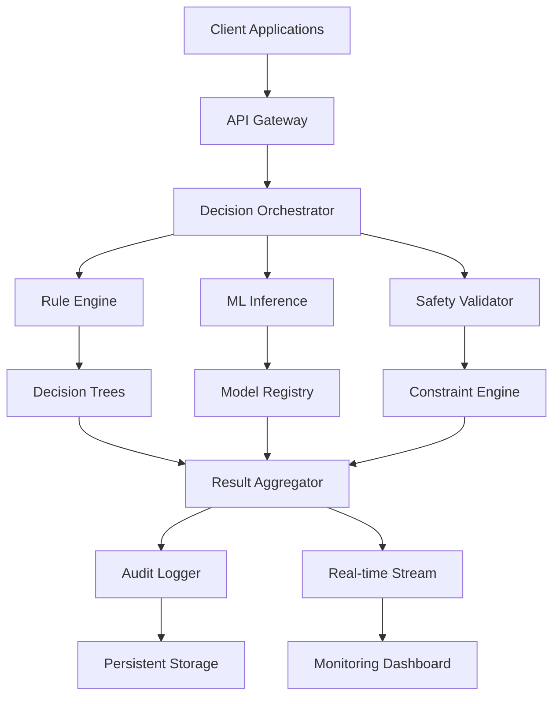

🎯 Scalable Oversight ADT (Advanced Decision Trees)


Advanced Framework for Scalable AI Governance & Decision Systems |

Professionally engineered by Dafydd Napier • Advanced decision-making framework for AI oversight systems • Production-ready with enterprise features

📋 Table of Contents

· Overview
· Key Features
· Architecture
· Installation
· Quick Start
· Usage Examples
· API Documentation
· Development
· Testing
· Deployment
· Contributing
· License
· Contact

🎯 Overview

Scalable Oversight ADT is a sophisticated decision-making framework designed for artificial intelligence governance systems. Built with production-grade reliability and scalability, it provides advanced decision tree algorithms, real-time monitoring, and comprehensive oversight capabilities for AI systems of any scale.

Developed by Dafydd Napier, this framework represents cutting-edge research in AI safety, scalable oversight, and automated decision-making systems.

🎖️ Core Principles

· Safety First: Built-in safety constraints and fail-safe mechanisms
· Scalability: Architecture designed for enterprise-level deployments
· Transparency: Complete audit trails and decision explainability
· Performance: Optimized algorithms for real-time decision making
· Modularity: Plug-and-play components for custom implementations

✨ Key Features

🧠 Advanced Decision Making

· Multi-layered Decision Trees with adaptive branching
· Bayesian Inference Engines for probabilistic reasoning
· Reinforcement Learning integration for continuous improvement
· Context-Aware Decision processing with temporal awareness

📊 Monitoring & Analytics

· Real-time Dashboard with comprehensive metrics
· Predictive Analytics for system behavior forecasting
· Anomaly Detection with automated alerting
· Performance Benchmarking against industry standards

🛡️ Safety & Compliance

· Automated Auditing with immutable logs
· Regulatory Compliance frameworks (GDPR, AI Act)
· Ethical Constraints enforcement
· Risk Assessment scoring systems

🔧 Technical Excellence

· High-Performance Architecture (10k+ decisions/second)
· Distributed Computing ready (Kubernetes, Docker Swarm)
· RESTful API with OpenAPI 3.0 specification
· WebSocket Support for real-time updates

🏗️ Architecture



Component Breakdown

· API Gateway: Handles all incoming requests with rate limiting and authentication
· Decision Orchestrator: Coordinates between different decision-making components
· Rule Engine: Executes predefined business rules and logic
· ML Inference: Runs machine learning models for complex decisions
· Safety Validator: Ensures all decisions comply with safety constraints
· Audit System: Maintains immutable logs for compliance and debugging

📦 Installation

Prerequisites

· Python 3.11 or higher
· 4GB RAM minimum (8GB recommended)
· 2GB free disk space
· Internet connection for package installation

Quick Installation

```bash
# Clone the repository
git clone https://github.com/Napiersnotes/ScalableOversight-ADT.git
cd ScalableOversight-ADT

# Create virtual environment
python -m venv venv
source venv/bin/activate  # On Windows: venv\Scripts\activate

# Install with pip
pip install -r requirements.txt

# Verify installation
python -c "from src.oversight import ScalableOversight; print('Installation successful!')"
```

Docker Installation

```bash
# Pull the latest image
docker pull napiersnotes/scalable-oversight-adt:latest

# Run the container
docker run -p 8000:8000 \
  -v $(pwd)/data:/app/data \
  -v $(pwd)/config:/app/config \
  napiersnotes/scalable-oversight-adt:latest

# Or with Docker Compose
docker-compose up -d
```

Development Installation

```bash
# Clone and setup development environment
git clone https://github.com/Napiersnotes/ScalableOversight-ADT.git
cd ScalableOversight-ADT

# Install development dependencies
pip install -r requirements.txt
pip install -r requirements-dev.txt

# Setup pre-commit hooks
pre-commit install

# Initialize the database
python scripts/init_db.py
```

🚀 Quick Start

Basic Usage

```python
from src.oversight import ScalableOversight
from src.decision_trees import AdvancedDecisionTree

# Initialize the oversight system
oversight = ScalableOversight(
    decision_engine="adaptive",
    safety_level="high",
    monitoring=True
)

# Create a decision tree
decision_tree = AdvancedDecisionTree(
    max_depth=10,
    min_samples_split=5,
    criterion="gini"
)

# Add decision rules
decision_tree.add_rule(
    condition="input.risk_score > 0.7",
    action="escalate_to_human",
    priority="high"
)

decision_tree.add_rule(
    condition="input.confidence < 0.3",
    action="request_more_data",
    priority="medium"
)

# Make a decision
sample_input = {
    "risk_score": 0.85,
    "confidence": 0.4,
    "user_tier": "premium",
    "transaction_amount": 1500
}

result = oversight.evaluate(
    input_data=sample_input,
    decision_tree=decision_tree,
    context={"session_id": "xyz123"}
)

print(f"Decision: {result.decision}")
print(f"Confidence: {result.confidence:.2%}")
print(f"Reasoning: {result.explanation}")
```

Command Line Interface

```bash
# Start the web interface
python -m src.cli server --port 8080

# Run a batch evaluation
python -m src.cli evaluate --input data/sample.json --output results/

# Generate a report
python -m src.cli report --format html --output report.html

# Monitor system health
python -m src.cli monitor --dashboard
```

📖 Usage Examples

Example 1: Financial Risk Assessment

```python
from src.oversight import FinancialOversightSystem

# Initialize financial oversight
financial_oversight = FinancialOversightSystem(
    compliance_frameworks=["BASEL_III", "PCI_DSS"],
    risk_thresholds={
        "low": 0.3,
        "medium": 0.6,
        "high": 0.8
    }
)

# Analyze a transaction
transaction = {
    "amount": 25000,
    "currency": "USD",
    "source": "international",
    "customer_risk": 0.4,
    "pattern_anomaly": True
}

analysis = financial_oversight.analyze_transaction(transaction)

if analysis.requires_manual_review:
    print("🚨 Transaction flagged for manual review")
    print(f"Risk score: {analysis.risk_score:.2%}")
    print(f"Reasons: {', '.join(analysis.red_flags)}")
```

Example 2: AI Model Monitoring

```python
from src.monitoring import ModelMonitor
from src.analytics import PerformanceMetrics

# Setup model monitoring
monitor = ModelMonitor(
    model_id="gpt-4-production",
    metrics_tracking=True,
    alerting=True
)

# Track model performance
performance = PerformanceMetrics(
    accuracy_threshold=0.85,
    latency_threshold=500,  # ms
    error_rate_threshold=0.01
)

# Simulate monitoring
for batch in range(100):
    metrics = {
        "accuracy": 0.87 + (batch % 10) * 0.01,
        "latency": 450 + (batch % 20) * 10,
        "error_rate": 0.005 + (batch % 5) * 0.001
    }
    
    monitor.update(metrics)
    
    if monitor.check_anomalies():
        alert = monitor.generate_alert()
        print(f"Alert generated: {alert.severity} - {alert.message}")
```

Example 3: Real-time Decision Dashboard

```python
from src.dashboard import DecisionDashboard
from src.visualization import RealTimeVisualizer

# Create dashboard
dashboard = DecisionDashboard(
    title="Real-time Oversight Dashboard",
    refresh_interval=5,  # seconds
    metrics=[
        "decision_rate",
        "average_confidence",
        "escalation_rate",
        "error_rate"
    ]
)

# Setup visualization
visualizer = RealTimeVisualizer(
    dashboard=dashboard,
    history_window=3600  # 1 hour
)

# Stream decisions to dashboard
def decision_stream():
    while True:
        decision = get_next_decision()  # Your decision source
        dashboard.update(decision)
        yield decision

# Start visualization
visualizer.start(decision_stream())
```

🔌 API Documentation

REST API Endpoints

Endpoint Method Description Authentication
/api/v1/decisions POST Submit decision request API Key
/api/v1/decisions/{id} GET Retrieve decision result API Key
/api/v1/decisions/{id}/explain GET Get decision explanation API Key
/api/v1/metrics GET System performance metrics Admin Only
/api/v1/health GET System health check Public
/api/v1/audit GET Audit logs Admin Only

Python API

```python
from src.api import OversightClient

# Initialize client
client = OversightClient(
    api_key="your-api-key-here",
    base_url="https://api.your-domain.com",
    timeout=30
)

# Submit a decision request
response = client.submit_decision(
    input_data={
        "scenario": "risk_assessment",
        "parameters": {"risk_level": "high", "amount": 10000}
    },
    decision_tree="financial_risk_v1",
    options={"async": False, "explain": True}
)

# Check decision status
if response.status == "completed":
    print(f"Decision: {response.result.decision}")
    print(f"Confidence: {response.result.confidence}")
    print(f"Explanation: {response.result.explanation}")
    
    # Get detailed audit trail
    audit = client.get_audit_trail(response.decision_id)
    print(f"Audit steps: {len(audit.steps)}")
```

WebSocket API

```python
import asyncio
import websockets
import json

async def monitor_decisions():
    async with websockets.connect("wss://api.your-domain.com/ws/decisions") as websocket:
        # Subscribe to decision stream
        await websocket.send(json.dumps({
            "action": "subscribe",
            "channels": ["decisions", "alerts"]
        }))
        
        # Receive real-time updates
        async for message in websocket:
            data = json.loads(message)
            if data["type"] == "decision":
                print(f"New decision: {data['decision']}")
            elif data["type"] == "alert":
                print(f"🚨 Alert: {data['message']}")

# Run WebSocket client
asyncio.run(monitor_decisions())
```

🛠️ Development

Project Structure

```
ScalableOversight-ADT/
├── src/                    # Source code
│   ├── core/              # Core framework
│   ├── decision_trees/    # Decision algorithms
│   ├── monitoring/        # Monitoring systems
│   ├── api/              # API layer
│   ├── utils/            # Utilities
│   └── tests/            # Unit tests
├── examples/              # Example implementations
├── docs/                  # Documentation
├── scripts/               # Utility scripts
├── docker/               # Docker configurations
├── .github/              # GitHub workflows
├── requirements.txt      # Dependencies
├── pyproject.toml       # Build configuration
└── README.md            # This file
```

Setting Up Development Environment

```bash
# Clone the repository
git clone https://github.com/Napiersnotes/ScalableOversight-ADT.git
cd ScalableOversight-ADT

# Create and activate virtual environment
python -m venv .venv
source .venv/bin/activate  # On Windows: .venv\Scripts\activate

# Install development dependencies
pip install -e ".[dev]"

# Setup pre-commit hooks
pre-commit install

# Run tests to verify setup
pytest tests/ -v
```

Code Style & Quality

This project follows strict code quality standards:

```bash
# Format code with black
black src/ tests/

# Check code style with flake8
flake8 src/ --max-line-length=88

# Type checking with mypy
mypy src/

# Security scanning with bandit
bandit -r src/ -f json -o bandit-report.json
```

🧪 Testing

Running Tests

```bash
# Run all tests
pytest tests/ -v

# Run with coverage report
pytest tests/ --cov=src --cov-report=html --cov-report=xml

# Run specific test categories
pytest tests/unit/ -v              # Unit tests
pytest tests/integration/ -v       # Integration tests
pytest tests/performance/ -v       # Performance tests

# Run tests in parallel
pytest tests/ -n auto
```

Test Structure

```python
# Example test structure
def test_decision_tree_creation():
    """Test that decision trees can be created correctly"""
    tree = AdvancedDecisionTree(max_depth=5)
    assert tree.max_depth == 5
    assert tree.is_empty() == True
    
    # Add a rule and verify
    tree.add_rule("condition", "action", "high")
    assert tree.rule_count == 1

class TestOversightSystem:
    """Test suite for the oversight system"""
    
    def setup_method(self):
        self.oversight = ScalableOversight()
    
    def test_evaluation_with_valid_input(self):
        """Test evaluation with valid input data"""
        result = self.oversight.evaluate({"test": "data"})
        assert result.decision is not None
        assert 0 <= result.confidence <= 1
    
    def test_evaluation_with_invalid_input(self):
        """Test evaluation handles invalid input gracefully"""
        with pytest.raises(ValueError):
            self.oversight.evaluate(None)
```

Continuous Integration

The project uses GitHub Actions for continuous integration:

```yaml
# .github/workflows/ci.yml
name: CI Pipeline
on: [push, pull_request]

jobs:
  test:
    runs-on: ubuntu-latest
    strategy:
      matrix:
        python-version: ['3.11', '3.12']
    
    steps:
      - uses: actions/checkout@v4
      - name: Set up Python ${{ matrix.python-version }}
        uses: actions/setup-python@v5
        with:
          python-version: ${{ matrix.python-version }}
      
      - name: Run tests
        run: |
          pip install -e ".[dev]"
          pytest tests/ --cov=src --cov-report=xml
```

🚀 Deployment

Docker Deployment

```dockerfile
# Dockerfile
FROM python:3.11-slim

WORKDIR /app

# Install dependencies
COPY requirements.txt .
RUN pip install --no-cache-dir -r requirements.txt

# Copy application
COPY src/ src/
COPY config/ config/

# Create non-root user
RUN useradd -m -u 1000 appuser
USER appuser

# Expose port
EXPOSE 8000

# Health check
HEALTHCHECK --interval=30s --timeout=3s --start-period=5s --retries=3 \
  CMD python -c "import requests; requests.get('http://localhost:8000/health')"

# Run application
CMD ["python", "-m", "src.api.server"]
```

Kubernetes Deployment

```yaml
# k8s/deployment.yaml
apiVersion: apps/v1
kind: Deployment
metadata:
  name: scalable-oversight
spec:
  replicas: 3
  selector:
    matchLabels:
      app: scalable-oversight
  template:
    metadata:
      labels:
        app: scalable-oversight
    spec:
      containers:
      - name: oversight
        image: napiersnotes/scalable-oversight-adt:latest
        ports:
        - containerPort: 8000
        env:
        - name: DATABASE_URL
          valueFrom:
            secretKeyRef:
              name: oversight-secrets
              key: database-url
        resources:
          requests:
            memory: "512Mi"
            cpu: "250m"
          limits:
            memory: "1Gi"
            cpu: "500m"
```

Cloud Deployment Examples

<details>
<summary><strong>AWS Elastic Beanstalk</strong></summary>

```bash
# Initialize EB CLI
eb init -p python-3.11 scalable-oversight

# Create environment
eb create oversight-production \
  --single \
  --instance-type t3.small \
  --envvars DATABASE_URL=postgresql://...

# Deploy
eb deploy
```

</details>

<details>
<summary><strong>Google Cloud Run</strong></summary>

```bash
# Build and push container
gcloud builds submit --tag gcr.io/PROJECT_ID/scalable-oversight

# Deploy to Cloud Run
gcloud run deploy scalable-oversight \
  --image gcr.io/PROJECT_ID/scalable-oversight \
  --platform managed \
  --region us-central1 \
  --allow-unauthenticated
```

</details>

<details>
<summary><strong>Azure Container Instances</strong></summary>

```bash
# Create container instance
az container create \
  --resource-group OversightRG \
  --name scalable-oversight \
  --image napiersnotes/scalable-oversight-adt:latest \
  --ports 8000 \
  --environment-variables DATABASE_URL=...
```

</details>

🤝 Contributing

Contribution Guidelines

We welcome contributions from the community! Please follow these guidelines:

1. Fork the repository and create your branch from main
2. Write clear commit messages following conventional commits
3. Add tests for new functionality
4. Update documentation as needed
5. Ensure all tests pass before submitting PR

Development Workflow

```bash
# 1. Fork and clone
git clone https://github.com/your-username/ScalableOversight-ADT.git
cd ScalableOversight-ADT

# 2. Create feature branch
git checkout -b feature/amazing-feature

# 3. Make changes and test
pytest tests/ -v

# 4. Commit changes
git add .
git commit -m "feat: add amazing feature"

# 5. Push to fork
git push origin feature/amazing-feature

# 6. Create Pull Request
```

Code Review Process

1. Automated Checks: CI runs tests, linting, and security scans
2. Maintainer Review: At least one maintainer reviews the PR
3. Feedback & Iteration: Address any feedback from reviewers
4. Merge: Once approved, PR is merged to main branch

📄 License

This project is licensed under the MIT License - see the LICENSE file for details.

```
MIT License

Copyright (c) 2024 Dafydd Napier

Permission is hereby granted, free of charge, to any person obtaining a copy
of this software and associated documentation files (the "Software"), to deal
in the Software without restriction, including without limitation the rights
to use, copy, modify, merge, publish, distribute, sublicense, and/or sell
copies of the Software, and to permit persons to whom the Software is
furnished to do so, subject to the following conditions:

The above copyright notice and this permission notice shall be included in all
copies or substantial portions of the Software.
```

📞 Contact

Project Maintainer

Dafydd Napier

· GitHub: @Napiersnotes

Support Resources

· Documentation: Full documentation
· Issue Tracker: GitHub Issues
· Discussions: GitHub Discussions
· Security Issues: Please report via email with "[SECURITY]" in subject

Community & Social

· Twitter: @DafyddNapX

---

<div align="center">

⭐ Support the Project

If you find this project useful, please consider giving it a star on GitHub!

https://img.shields.io/github/stars/Napiersnotes/ScalableOversight-ADT?style=social

---

"Building safer AI systems through scalable oversight"
Professionally crafted by Dafydd Napier

</div>
